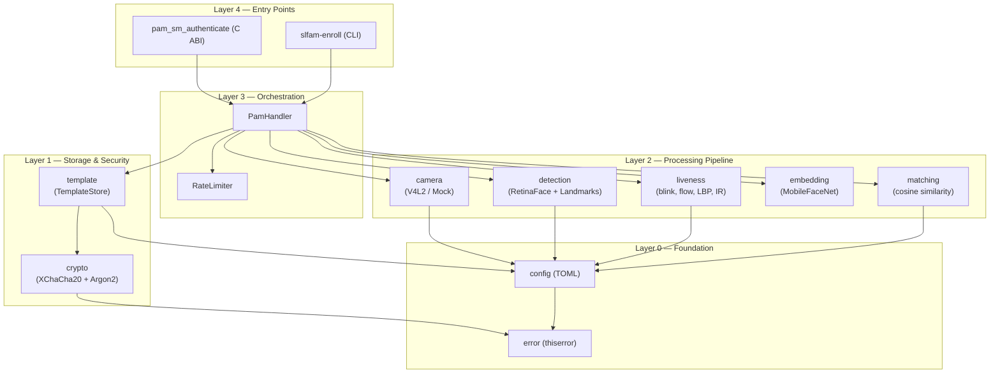
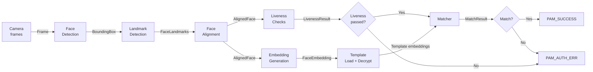
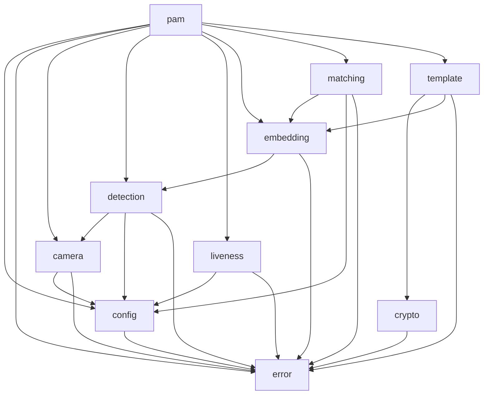
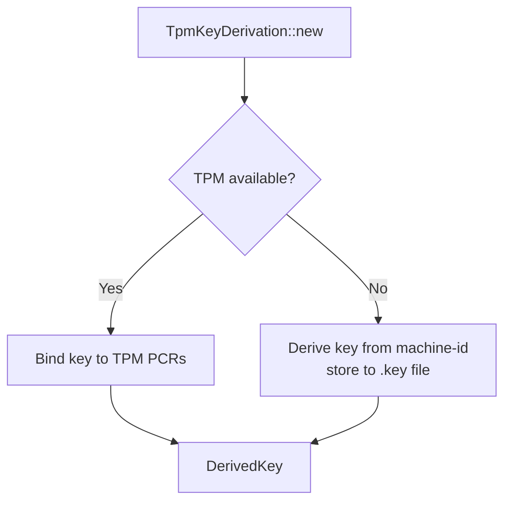

# Architecture — SLFAM

## Layered Architecture

SLFAM is organized in four horizontal layers. Each layer only depends on layers below it.

## Data Flow: Authentication

## Module Dependency Graph

## Key Design Decisions

### Trait-Based Camera Abstraction
The `Camera` trait (in `camera/mod.rs`) decouples the pipeline from hardware. `V4l2Camera` is the production implementation; `MockCamera` is used in tests. This means liveness and detection tests can run without physical hardware.

### Lazy Initialization in PamHandler
`PamHandler` defers loading `TemplateStore` and key derivation until the first authentication call. This avoids penalizing PAM load time when the module is loaded but authentication is never triggered.

### cdylib + rlib Dual Output
`Cargo.toml` declares `crate-type = ["lib", "cdylib"]`. The cdylib produces the `.so` that PAM loads via `dlopen`. The rlib allows the enrollment CLI to link against the library directly without going through C FFI.

### Zeroize-on-Drop for Secrets
`DerivedKey`, face embeddings during processing, and template data implement `ZeroizeOnDrop` (via the `zeroize` crate). This ensures sensitive data is wiped from memory when it goes out of scope, even on panic paths.

### Error Hierarchy
All errors wrap into `AuthError` via `#[from]` conversions. Each subsystem has its own typed error enum (e.g., `CameraError`, `CryptoError`). The `AuthError::should_fallback()` and `is_security_concern()` methods let the PAM layer decide the appropriate PAM result code without inspecting error variants directly.

### Rate Limiting
`RateLimiter` in `pam/handler.rs` tracks failed attempts per user in memory. On lockout, `AuthError::RateLimited` is returned with the remaining lockout duration. This prevents brute-force attempts against the matching threshold.

### Security Levels
`Matcher` supports `SecurityLevel::Normal` (threshold ~0.75) and `SecurityLevel::High` (~0.85). The PAM module selects the level based on the `[matching]` config section, allowing operators to tune false-accept/false-reject tradeoff per deployment.

## TPM Integration

When the `tpm` feature is enabled and `security.use_tpm = true`, `TpmKeyDerivation` attempts to bind the template encryption key to the TPM. If TPM is unavailable, it falls back to `PasswordKeyDerivation` using a machine-derived secret stored at `template_dir/.key`. The fallback is transparent to upper layers through the `KeyDerivation` trait.

## Security Boundary

The PAM module runs as root (or with elevated privileges). The security boundary is:

- **Inbound trust**: Camera frame data is untrusted (potential spoofing).
- **Liveness checks**: Four independent signals (blink, optical flow, LBP, IR) must all pass (configurable).
- **Template integrity**: Templates are AEAD-encrypted; tampering causes decryption failure.
- **Audit log**: All authentication attempts are logged without biometric data.
- **No network**: Zero outbound connections at any point.
