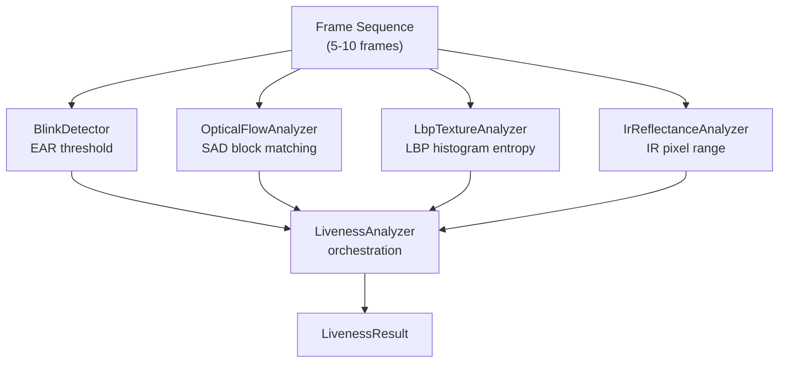
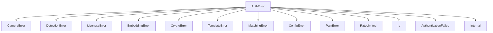

# Components — SLFAM

## camera

**Location:** `slfam/src/camera/`

Abstracts camera hardware. Provides a unified `Camera` trait so the rest of the pipeline is hardware-agnostic.

### Key Types

| Type | File | Responsibility |
|---|---|---|
| `Camera` (trait) | `mod.rs` | Capture frames, stream control, device info |
| `V4l2Camera` | `v4l2.rs` | Production camera using raw V4L2 ioctls (no v4l crate dependency by default) |
| `MockCamera` | `mock.rs` | Test camera that yields pre-loaded or generated frames |
| `Frame` | `frame.rs` | Owned frame buffer with format metadata |
| `FrameFormat` | `frame.rs` | `BGR24`, `YUYV`, `Grayscale` variants |
| `CameraInfo` | `device.rs` | Device path, type (RGB/IR), supported resolutions |
| `CameraType` | `device.rs` | `Rgb` / `Ir` — used to route frames to correct pipeline |
| `DeviceLock` | `mod.rs` | File-based mutex to prevent concurrent camera access |

### Key Methods

- `Camera::capture_frame() -> Result<Frame>` — single frame acquisition
- `Camera::capture_frames(n) -> Result<Vec<Frame>>` — multi-frame capture for liveness
- `V4l2Camera::init_mmap()` — sets up memory-mapped buffer ring
- `Frame::to_bgr24()` / `to_grayscale()` — pixel format conversion
- `Frame::extract_roi(x, y, w, h)` — region-of-interest crop
- `enumerate_cameras()` / `find_rgb_camera()` / `find_ir_camera()` — device discovery

---

## detection

**Location:** `slfam/src/detection/`

Two-stage face detection: coarse bounding box (RetinaFace) → precise landmarks → affine alignment.

### Key Types

| Type | File | Responsibility |
|---|---|---|
| `FaceDetectionPipeline` | `mod.rs` | Orchestrates detector + landmark + alignment |
| `ProcessedFace` | `mod.rs` | Detected face with bounding box, landmarks, aligned image |
| `BoundingBox` | `mod.rs` | x, y, w, h rectangle with IoU and expand helpers |
| `FaceDetector` | `retinaface.rs` | RetinaFace ONNX model wrapper |
| `DetectedFace` | `retinaface.rs` | Bounding box + confidence from detector |
| `LandmarkDetector` | `landmarks.rs` | 68-point or 5-point landmark model |
| `FaceLandmarks` | `landmarks.rs` | Structured landmark access (eyes, nose, mouth, jaw) |
| `AlignedFace` | `alignment.rs` | 112×112 BGR face crop aligned via similarity transform |
| `SimilarityTransform` | `alignment.rs` | Affine transform matrix (rotation, scale, translation) |
| `OnnxModel` | `onnx.rs` | Generic ONNX inference runner via `ort` |

### Key Methods

- `FaceDetectionPipeline::process_frame(frame) -> Result<ProcessedFace>` — full pipeline
- `FaceDetectionPipeline::detect_faces(frame)` — detection only
- `FaceDetectionPipeline::get_landmarks(face, frame)` — landmark extraction
- `OnnxModel::run(input) -> Result<outputs>` — ONNX inference
- `align_face_5point(frame, landmarks)` — canonical 112×112 alignment
- `BoundingBox::iou(other)` — for NMS in detection

---

## liveness

**Location:** `slfam/src/liveness/`

Multi-signal passive liveness detection. Four independent analyzers feed into `LivenessAnalyzer`.

### Key Types

| Type | File | Responsibility |
|---|---|---|
| `LivenessAnalyzer` | `mod.rs` | Orchestrates all liveness checks across a frame sequence |
| `LivenessChecks` | `mod.rs` | Flags indicating which checks are enabled/passed |
| `LivenessResult` | `mod.rs` | Pass/fail + per-check results |
| `CheckResult` | `mod.rs` | Single check outcome with score and reason |
| `BlinkDetector` | `blink.rs` | Eye Aspect Ratio (EAR)-based blink detection |
| `BlinkState` | `blink.rs` | State machine: `Open → Closing → Closed → Opening → Open` |
| `OpticalFlowAnalyzer` | `optical_flow.rs` | SAD-based block matching to detect natural motion |
| `GradientMotionDetector` | `optical_flow.rs` | Gradient-based motion for fallback |
| `LbpTextureAnalyzer` | `lbp.rs` | LBP histogram texture analysis (detects printed photos) |
| `GradientTextureAnalyzer` | `lbp.rs` | Gradient-based texture fallback |
| `IrReflectanceAnalyzer` | `ir.rs` | IR reflectance range check + screen pattern detection |

### Liveness Signal Summary



### Key Methods

- `LivenessAnalyzer::add_frame(frame, landmarks)` — feed frames incrementally
- `LivenessAnalyzer::analyze() -> Result<LivenessResult>` — compute all checks
- `BlinkDetector::update(landmarks)` — update EAR state machine
- `LbpTextureAnalyzer::analyze(face_roi)` — compute LBP uniformity/entropy

---

## embedding

**Location:** `slfam/src/embedding/`

Generates 512-dimensional face embeddings using MobileFaceNet.

### Key Types

| Type | File | Responsibility |
|---|---|---|
| `EmbeddingGenerator` | `mobilefacenet.rs` | MobileFaceNet ONNX model wrapper |
| `FaceEmbedding` | `mobilefacenet.rs` | 512D f32 vector, zeroize-on-drop |
| `MockEmbeddingGenerator` | `mobilefacenet.rs` | Returns deterministic or random embeddings for tests |

### Math Utilities (`mod.rs`)

- `cosine_similarity(a, b) -> f32` — primary similarity metric
- `euclidean_distance(a, b) -> f32`
- `l2_normalize(v)` / `l2_normalized(v) -> Vec<f32>`

### Key Methods

- `EmbeddingGenerator::generate(aligned_face) -> Result<FaceEmbedding>`
- `EmbeddingGenerator::generate_from_raw(bytes, w, h) -> Result<FaceEmbedding>`
- `FaceEmbedding::similarity(other) -> f32` — cosine similarity shortcut
- `FaceEmbedding::to_bytes()` / `from_bytes()` — serialization for storage

---

## matching

**Location:** `slfam/src/matching/mod.rs`

Compares a probe embedding against one or more stored embeddings and produces an authentication decision.

### Key Types

| Type | Responsibility |
|---|---|
| `Matcher` | Core engine: holds config and security level |
| `MatchResult` | Matched bool, similarity score, threshold used, timing |
| `MatchDetails` | Best template index, all scores, security level used |
| `SecurityLevel` | `Normal` / `High` — selects threshold |
| `IdentificationMatcher` | 1:N identification (find who this is) |
| `IdentificationResult` | Best match user ID + score |

### Key Methods

- `Matcher::match_one(probe, template_embeddings) -> Result<MatchResult>`
- `Matcher::match_many(probe, all_templates)` — best-of-N matching
- `Matcher::set_security_level(level)` — switch threshold at runtime
- `Matcher::verify_with_checks(probe, template, min_samples)` — verification with sample count guard
- `compute_eer_threshold(scores)` — Equal Error Rate threshold computation
- `threshold_for_far(scores, target_far)` — FAR-targeted threshold

---

## crypto

**Location:** `slfam/src/crypto/`

Encryption and key derivation. All sensitive material is zeroized on drop.

### Key Types

| Type | File | Responsibility |
|---|---|---|
| `EncryptedData` | `xchacha.rs` | Ciphertext + nonce container |
| `DerivedKey` | `keys.rs` | 32-byte key, `ZeroizeOnDrop` |
| `PasswordKeyDerivation` | `keys.rs` | Argon2id (64MiB, 3 iter, 4 lanes) |
| `TpmKeyDerivation` | `keys.rs` | TPM-bound or file-based machine key |
| `MachineIdKeyDerivation` | `keys.rs` | Derives key from `/etc/machine-id` |
| `KeyDerivation` (trait) | `keys.rs` | `derive_key(user_id, context) -> DerivedKey` |

### Key Methods

- `encrypt(plaintext, key, aad) -> Result<EncryptedData>` — XChaCha20-Poly1305
- `decrypt(data, key, aad) -> Result<Vec<u8>>` — authenticated decryption
- `EncryptedData::to_bytes()` / `from_bytes()` — wire format
- `generate_nonce() -> [u8; 24]` — random 192-bit nonce
- `constant_time_eq(a, b)` — timing-safe comparison
- `secure_zero(buf)` — manual zeroize

---

## template

**Location:** `slfam/src/template/`

Persists and retrieves encrypted face templates.

### Key Types

| Type | File | Responsibility |
|---|---|---|
| `TemplateStore` | `storage.rs` | Filesystem CRUD for templates; holds in-memory cache |
| `Template` | `storage.rs` | Per-user container: embeddings + metadata |
| `TemplateMetadata` | `storage.rs` | Timestamps, auth count, last auth, device ID |

### Key Methods

- `TemplateStore::new(dir)` — open/create template directory
- `TemplateStore::save(user_id, template, key)` — encrypt and write
- `TemplateStore::load(user_id, key)` — read and decrypt
- `TemplateStore::list_users()` — enumerate stored templates
- `TemplateStore::delete(user_id)` — remove template file
- `Template::add_embedding(embedding)` — append embedding to set
- `TemplateMetadata::record_auth()` — update auth stats

---

## pam

**Location:** `slfam/src/pam/`

PAM module implementation. Exports C-ABI symbols and orchestrates the auth pipeline.

### Key Types

| Type | File | Responsibility |
|---|---|---|
| `PamHandler` | `handler.rs` | Wraps all auth state; called by PAM entry points |
| `RateLimiter` | `handler.rs` | Per-user attempt counter with lockout |
| `PamResultCode` | `mod.rs` | Maps to PAM integer result codes |
| `PamArgs` | `mod.rs` | Parsed PAM module arguments (timeout, debug, etc.) |
| `PamFlags` | `mod.rs` | PAM flag bitfield |
| `TerminalConversation` | `conversation.rs` | Sends prompts/messages via PAM conversation function |
| `NullConversation` | `conversation.rs` | Silent conversation (for non-interactive auth) |
| `MockConversation` | `conversation.rs` | Test conversation with scripted responses |

### PAM Exports

```c
// C ABI exports (called by PAM runtime)
int pam_sm_authenticate(pam_handle_t *pamh, int flags, int argc, const char **argv);
int pam_sm_setcred(pam_handle_t *pamh, int flags, int argc, const char **argv);
int pam_sm_acct_mgmt(pam_handle_t *pamh, int flags, int argc, const char **argv);
```

---

## config

**Location:** `slfam/src/config.rs`

Loads and validates the TOML configuration. All other modules receive a `Config` reference.

### Config Sections

| Section struct | Controls |
|---|---|
| `GeneralConfig` | `template_dir`, `model_dir`, `log_file`, `log_level`, `debug_mode` |
| `CameraConfig` | Device IDs, resolution, FPS, IR preference, auto-detect |
| `DetectionConfig` | Confidence threshold, NMS threshold, model paths |
| `LivenessConfig` | Enable/disable per-check, EAR threshold, LBP params |
| `MatchingConfig` | `threshold_normal`, `threshold_high_security`, min samples |
| `SecurityConfig` | `max_attempts`, `lockout_duration_sec`, `use_tpm` |
| `EnrollmentConfig` | Number of samples, variation requirements |

### Key Methods

- `Config::load(path) -> Result<Config>`
- `Config::load_or_default() -> Config` — falls back to defaults on missing file
- `Config::validate() -> Result<()>` — checks threshold ranges, path existence
- `Config::effective_threshold(level) -> f32`
- `Config::is_emergency_disabled() -> bool`

---

## error

**Location:** `slfam/src/error.rs`

Central error hierarchy. All errors convert into `AuthError`.

### Error Variants



### Decision Methods on AuthError

- `should_fallback() -> bool` — true for camera/hardware errors (use password instead)
- `is_security_concern() -> bool` — true for template tampering, crypto failures
- `sanitized_message() -> String` — removes sensitive path/user details for logging
