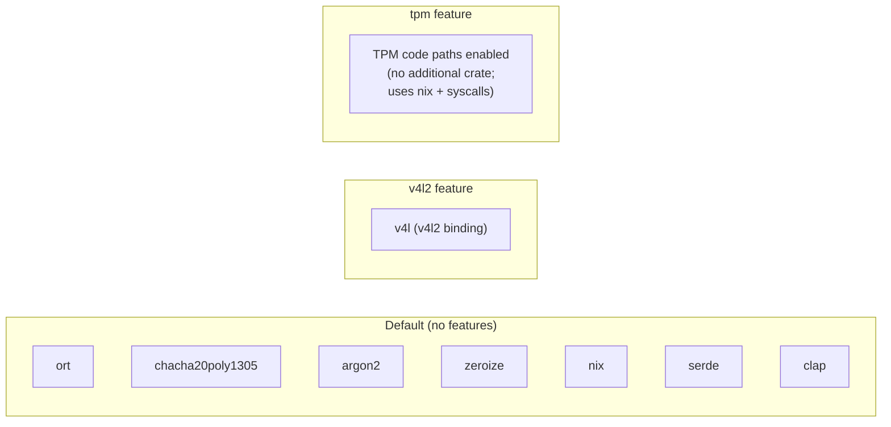

# Dependencies — SLFAM

All versions are from `slfam/Cargo.toml`.

## Runtime Dependencies

### ML Inference

| Crate | Version | Usage |
|---|---|---|
| `ort` | `2.0.0-rc.11` | ONNX Runtime bindings — runs RetinaFace, landmark, and MobileFaceNet models. Uses `ndarray` feature only; all other backends disabled via `default-features = false` |
| `ndarray` | `0.16` | N-dimensional arrays for ONNX input/output tensors |

**Note:** `ort` requires the ONNX Runtime shared library (`libonnxruntime.so`) at runtime. See `MODEL_SETUP.md` for installation.

---

### Cryptography

| Crate | Version | Usage |
|---|---|---|
| `chacha20poly1305` | `0.10` | XChaCha20-Poly1305 AEAD — template encryption |
| `argon2` | `0.5` | Argon2id key derivation — 64 MiB memory, 3 iterations, 4 lanes |
| `rand` | `0.8` | CSPRNG for nonce generation |
| `rand_chacha` | `0.3` | ChaCha20 RNG backend for `rand` |
| `zeroize` | `1.8` | Zeroize-on-drop for `DerivedKey`, `FaceEmbedding`; `derive` feature enables `#[derive(ZeroizeOnDrop)]` |

---

### Serialization

| Crate | Version | Usage |
|---|---|---|
| `serde` | `1.0` | Derive serialization for `Config`, `Template`, `TemplateMetadata`; `derive` feature |
| `serde_json` | `1.0` | JSON serialization of templates before encryption |
| `toml` | `0.8` | TOML deserialization for config file |
| `byteorder` | `1.5` | Endian-aware I/O for binary template file format |

---

### CLI

| Crate | Version | Usage |
|---|---|---|
| `clap` | `4.5` | Argument parsing for `slfam-enroll`; `derive` + `env` features |

---

### Error Handling & Logging

| Crate | Version | Usage |
|---|---|---|
| `thiserror` | `1.0` | Derive `Error` + `Display` for all error enums |
| `log` | `0.4` | Logging facade used throughout |
| `env_logger` | `0.11` | Log initialization for CLI binary |

---

### Utilities

| Crate | Version | Usage |
|---|---|---|
| `chrono` | `0.4` | Timestamps in audit log and template metadata; `serde` feature |
| `tempfile` | `3.12` | Atomic file writes via temp + rename pattern |
| `parking_lot` | `0.12` | Fast `Mutex`/`RwLock` for `TemplateStore` cache |
| `image` | `0.25` | JPEG/PNG decode for test fixtures and mock frames; `default-features = false`, `jpeg` + `png` only |

---

### Linux-Specific

| Crate | Version | Feature | Usage |
|---|---|---|---|
| `nix` | `0.29` | `fs, ioctl, poll` | V4L2 ioctls, file locking (`DeviceLock`), poll for camera readiness |
| `v4l` | `0.14` | `v4l2` feature | Optional higher-level V4L2 binding; only linked when `v4l2` feature is active |

---

## Dev Dependencies

| Crate | Version | Usage |
|---|---|---|
| `criterion` | `0.5` | Benchmarking; `html_reports` feature |
| `tempfile` | `3.12` | Temporary directories in tests |
| `rand` | `0.8` | Random data generation in tests |
| `proptest` | `1.5` | Property-based testing |
| `mockall` | `0.13` | Mock trait generation for unit tests |

---

## External Runtime Requirements

These are not Rust crates but are required at runtime:

| Dependency | Minimum Version | Purpose |
|---|---|---|
| ONNX Runtime | 1.14+ | Shared library for ML inference (`libonnxruntime.so`) |
| Linux V4L2 | kernel 3.x+ | Camera capture (`/dev/videoN`) |
| PAM | — | `libpam.so` for module loading |
| TPM 2.0 | — | Optional; for key binding (`security.use_tpm = true`) |

---

## Cargo Feature Impact on Dependencies

Without any features, V4L2 access uses raw ioctls via `nix` directly (in `camera/v4l2.rs`). The `v4l2` feature adds the higher-level `v4l` crate as an alternative backend.
