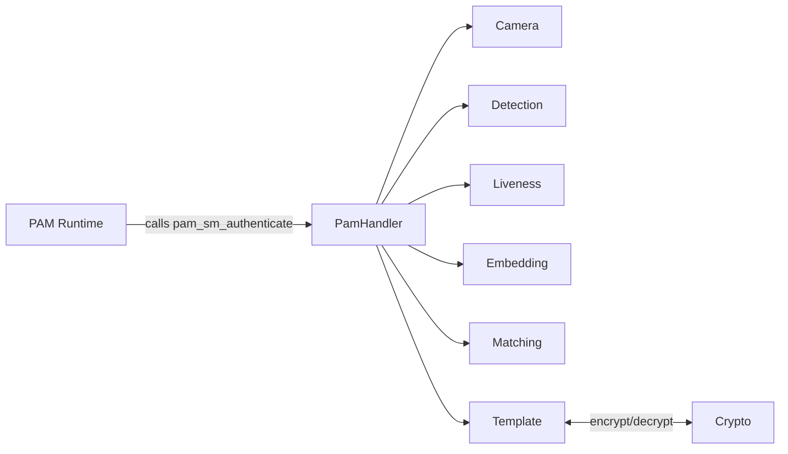
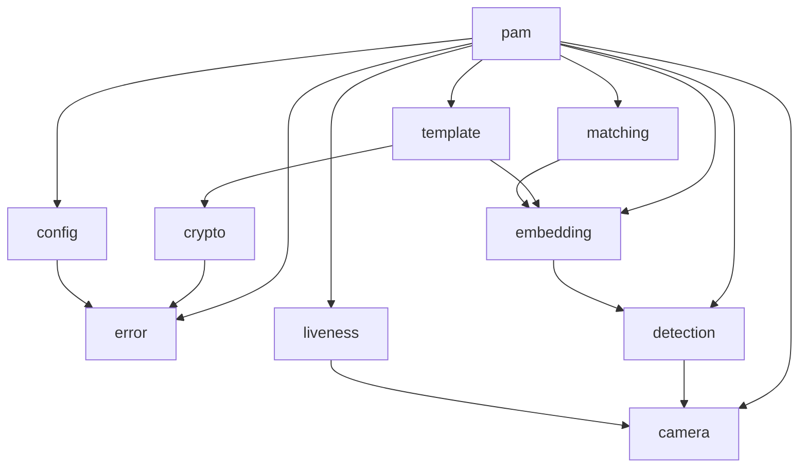

# SLFAM Documentation Index

> **For AI Assistants:** Start here. This file maps every documentation artifact to the questions it answers. Read this file first, then fetch only the specific file(s) relevant to your task. You do not need to read all files.

## How to Use This Index

1. Find your question type in the "Which file answers what" table below.
2. Read only the files listed for that question type.
3. Cross-reference related files only when the first file points you there.

## Documentation Files

| File | Audience | Answers questions about… |
|---|---|---|
| `codebase_info.md` | All | Repo layout, runtime paths, build outputs, Cargo features, constants |
| `architecture.md` | Developers, AI | System layers, module dependency graph, data flow, design decisions |
| `components.md` | Developers, AI | What each module/struct does, key methods, responsibility boundaries |
| `interfaces.md` | Integrators, AI | Public traits, PAM entry points, config surface, inter-module contracts |
| `data_models.md` | Developers, AI | Core structs/enums with fields, serialization format, template binary format |
| `workflows.md` | Developers, AI | Authentication flow, enrollment flow, liveness pipeline sequencing |
| `dependencies.md` | Developers | External crates, their versions, and why they are used |
| `review_notes.md` | Developers | Gaps, inconsistencies, and improvement recommendations |

## Which File Answers What

| Question | Primary File | Secondary File |
|---|---|---|
| Where is code for X feature? | `codebase_info.md` | `components.md` |
| How does authentication work end-to-end? | `workflows.md` | `architecture.md` |
| How does enrollment work? | `workflows.md` | `components.md` |
| What does module X do? | `components.md` | `interfaces.md` |
| What public API does X expose? | `interfaces.md` | `components.md` |
| What is the data structure for Y? | `data_models.md` | `interfaces.md` |
| How are templates stored/encrypted? | `data_models.md` | `workflows.md` |
| How do the liveness checks work? | `components.md` | `workflows.md` |
| What are the security design decisions? | `architecture.md` | `components.md` |
| What external libraries are used? | `dependencies.md` | `codebase_info.md` |
| What config options exist? | `data_models.md` | `codebase_info.md` |
| How is PAM integration wired up? | `interfaces.md` | `workflows.md` |
| What are known documentation gaps? | `review_notes.md` | — |

## System Overview

SLFAM is a **local, offline Linux PAM module** for facial authentication. It captures camera frames, detects and aligns a face, runs multi-signal liveness checks, generates a 512-dimensional embedding via MobileFaceNet, and compares it against an encrypted per-user template using cosine similarity. All templates are encrypted with XChaCha20-Poly1305, optionally bound to a TPM.

## Key Entry Points

| Entry Point | Location | Purpose |
|---|---|---|
| `pam_sm_authenticate` | `slfam/src/pam/mod.rs` | PAM authentication callback |
| `PamHandler::authenticate` | `slfam/src/pam/handler.rs` | Core auth orchestration |
| `slfam-enroll` binary | `slfam/src/bin/slfam-enroll.rs` | CLI for enrolling users |
| `FaceDetectionPipeline::process_frame` | `slfam/src/detection/mod.rs` | Full frame → detected face |
| `LivenessAnalyzer::analyze` | `slfam/src/liveness/mod.rs` | Multi-signal liveness check |
| `EmbeddingGenerator::generate` | `slfam/src/embedding/mobilefacenet.rs` | Face → 512D vector |
| `Matcher::match_one` | `slfam/src/matching/mod.rs` | Embedding → match decision |
| `TemplateStore::save` / `load` | `slfam/src/template/storage.rs` | Encrypted template I/O |

## Module Dependency Summary

## File Summaries

**`codebase_info.md`** — Authoritative reference for repo structure, runtime file locations, Cargo features, and build artifact names. Use when you need to find where something lives on disk.

**`architecture.md`** — Explains the layered architecture (PAM → pipeline → inference → crypto), security design decisions, and why certain patterns were chosen (e.g., trait-based camera abstraction, lazy initialization in PamHandler).

**`components.md`** — Per-module breakdown: what each struct does, its key public methods, and how it interacts with its neighbors. The best starting point for understanding a specific module.

**`interfaces.md`** — Documents traits (`KeyDerivation`, `Camera`), PAM C ABI exports, and the configuration surface. Useful when integrating or extending SLFAM.

**`data_models.md`** — Covers all key structs and enums with their fields (`Config`, `Template`, `FaceEmbedding`, `EncryptedData`, `MatchResult`, `Frame`, etc.) and the binary template file format.

**`workflows.md`** — Step-by-step sequence diagrams for the two primary flows: authentication and enrollment. Also covers the liveness sub-pipeline and error/fallback handling.

**`dependencies.md`** — Lists all external crates with versions, their role, and any notable configuration (e.g., `ort` with `ndarray` feature only, `chacha20poly1305` AEAD usage).

**`review_notes.md`** — Documents identified gaps (e.g., missing `slfam-test-auth` binary, no workspace Cargo.toml), inconsistencies, and recommendations.
