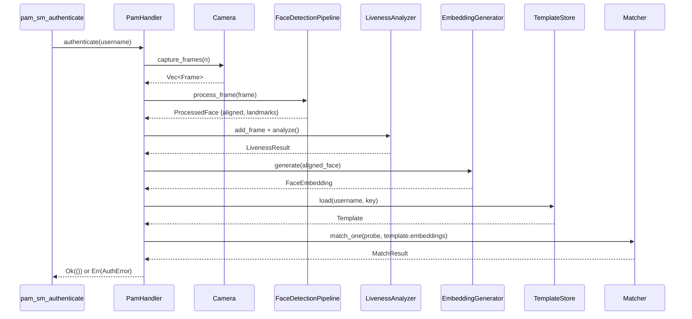

# Interfaces — SLFAM

## PAM C ABI (External Interface)

These are the symbols exported by `libslfam.so` that the PAM runtime calls. Defined in `slfam/src/pam/mod.rs`.

```c
// Authentication — primary entry point
int pam_sm_authenticate(pam_handle_t *pamh, int flags, int argc, const char **argv);

// Set credentials — currently returns PAM_SUCCESS (no-op)
int pam_sm_setcred(pam_handle_t *pamh, int flags, int argc, const char **argv);

// Account management — currently returns PAM_SUCCESS (no-op)
int pam_sm_acct_mgmt(pam_handle_t *pamh, int flags, int argc, const char **argv);
```

### PAM Module Arguments (`argc`/`argv`)

Passed via the PAM config line, e.g., `auth sufficient pam_slfam.so timeout=5 debug`:

| Argument | Type | Default | Effect |
|---|---|---|---|
| `timeout=N` | u32 (seconds) | from config | Override camera timeout |
| `debug` | flag | false | Enable verbose PAM logging |
| `no_warn` | flag | false | Suppress warning messages |
| `try_first_pass` | flag | false | Try password from prior module |

### PAM Return Code Mapping

| `AuthError` variant | `PamResultCode` |
|---|---|
| `AuthenticationFailed` | `AuthError` (7) |
| `RateLimited` | `MaxTries` (11) |
| Camera/hardware error | `AuthInfoUnavail` (9) — triggers fallback |
| Template not found | `UserUnknown` (10) |
| `Config` error | `SystemErr` (4) |

---

## Rust Public Traits

### `Camera` Trait (`slfam/src/camera/mod.rs`)

```rust
pub trait Camera {
    fn info(&self) -> &CameraInfo;
    fn is_ir(&self) -> bool;
    fn capture_frame(&mut self) -> Result<Frame>;
    fn capture_frames(&mut self, count: usize) -> Result<Vec<Frame>>;
    fn start_streaming(&mut self) -> Result<()>;
    fn stop_streaming(&mut self) -> Result<()>;
    fn is_available(&self) -> bool;
    fn device_path(&self) -> &Path;
    fn time_since_last_capture(&self) -> Option<Duration>;
}
```

Implemented by: `V4l2Camera`, `MockCamera`.

### `KeyDerivation` Trait (`slfam/src/crypto/keys.rs`)

```rust
pub trait KeyDerivation {
    fn derive_key(&self, user_id: &str, context: &[u8]) -> Result<DerivedKey>;
}
```

Implemented by: `PasswordKeyDerivation`, `TpmKeyDerivation`, `MachineIdKeyDerivation`.

### `PamConversation` Trait (`slfam/src/pam/conversation.rs`)

```rust
pub trait PamConversation {
    fn info_message(&self, msg: &str);
    fn error_message(&self, msg: &str);
    fn prompt(&self, msg: &str) -> Result<String>;
    fn prompt_secret(&self, msg: &str) -> Result<String>;
    fn converse(&self, messages: &[PamMessage]) -> Result<Vec<PamResponse>>;
}
```

Implemented by: `TerminalConversation`, `NullConversation`, `MockConversation`.

---

## Public Rust API (Library Consumers)

The library exports via `slfam::prelude`:

```rust
pub use crate::config::Config;
pub use crate::error::{AuthError, Result};
pub use crate::camera::{Camera, Frame};
pub use crate::detection::{FaceDetectionPipeline, ProcessedFace, BoundingBox};
pub use crate::embedding::{FaceEmbedding, EmbeddingGenerator};
pub use crate::matching::{Matcher, MatchResult};
pub use crate::template::{Template, TemplateStore};
```

### Key Function Signatures

```rust
// Config
Config::load(path: &Path) -> Result<Config>
Config::load_or_default() -> Config
Config::validate(&self) -> Result<()>
Config::effective_threshold(&self, level: SecurityLevel) -> f32

// Detection pipeline
FaceDetectionPipeline::new(config: &DetectionConfig) -> Result<Self>
FaceDetectionPipeline::process_frame(&mut self, frame: &Frame) -> Result<ProcessedFace>

// Embedding
EmbeddingGenerator::load(model_path: &Path) -> Result<Self>
EmbeddingGenerator::generate(&self, face: &AlignedFace) -> Result<FaceEmbedding>
FaceEmbedding::similarity(&self, other: &FaceEmbedding) -> f32
FaceEmbedding::to_bytes(&self) -> Vec<u8>
FaceEmbedding::from_bytes(bytes: &[u8]) -> Result<Self>

// Matching
Matcher::new(config: MatchingConfig) -> Self
Matcher::match_one(&self, probe: &FaceEmbedding, stored: &[FaceEmbedding]) -> Result<MatchResult>
Matcher::set_security_level(&mut self, level: SecurityLevel)

// Template storage
TemplateStore::new(dir: &Path) -> Result<Self>
TemplateStore::save(&self, user_id: &str, template: &Template, key: &DerivedKey) -> Result<()>
TemplateStore::load(&self, user_id: &str, key: &DerivedKey) -> Result<Template>
TemplateStore::list_users(&self) -> Result<Vec<String>>
TemplateStore::delete(&self, user_id: &str) -> Result<()>

// Crypto
encrypt(plaintext: &[u8], key: &DerivedKey, aad: &[u8]) -> Result<EncryptedData>
decrypt(data: &EncryptedData, key: &DerivedKey, aad: &[u8]) -> Result<Vec<u8>>

// Liveness
LivenessAnalyzer::new(config: &LivenessConfig) -> Self
LivenessAnalyzer::add_frame(&mut self, frame: &Frame, landmarks: &FaceLandmarks)
LivenessAnalyzer::analyze(&self) -> Result<LivenessResult>
```

---

## Configuration Interface

Primary config file: `/etc/slfam/config.toml`

```toml
[general]
template_dir = "/var/lib/slfam/templates"
model_dir = "/usr/share/slfam/models"
log_file = "/var/log/slfam/audit.log"
log_level = "info"
debug_mode = false

[camera]
device_id = 0                  # index or "/dev/videoN"
ir_device_id = 1               # optional
capture_timeout_ms = 5000
timeout_secs = 10
frame_width = 640
frame_height = 480
fps = 30
prefer_ir = false
auto_detect = true

[detection]
# confidence_threshold, nms_threshold, model path overrides

[liveness]
require_blink = true
enable_lbp = true
enable_optical_flow = true
enable_ir = false              # requires IR camera

[matching]
threshold_normal = 0.75
threshold_high_security = 0.85
min_samples = 3                # minimum embeddings per template

[security]
max_attempts = 5
lockout_duration_sec = 900
use_tpm = false

[enrollment]
num_samples = 5
```

Full documented example: `slfam/config.example.toml`

---

## slfam-enroll CLI Interface

```
Usage: slfam-enroll [OPTIONS] --user <USER>

Options:
  -u, --user <USER>          Username to enroll
  -c, --config <PATH>        Config file path [default: /etc/slfam/config.toml]
  -s, --samples <N>          Number of samples to capture [default: from config]
  -d, --device <DEVICE>      Camera device override
      --delete               Delete existing enrollment for user
      --list                 List enrolled users
  -v, --verbose              Verbose output
  -h, --help                 Print help
```

---

## Inter-Module Contracts


