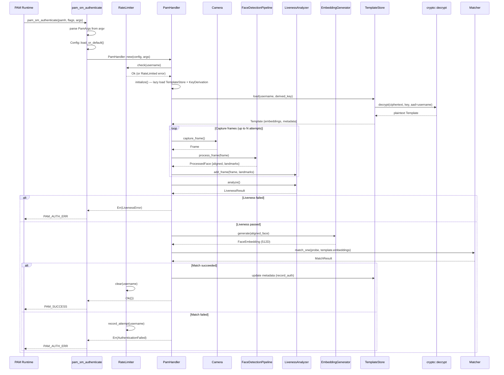
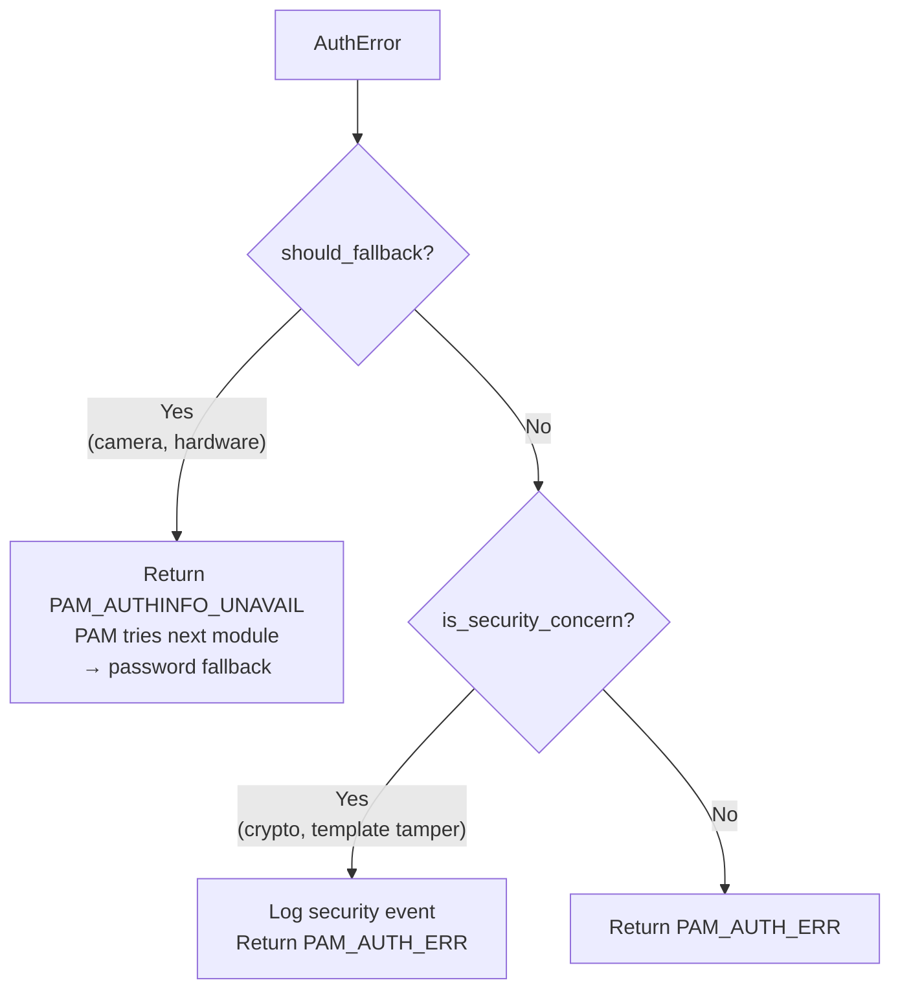
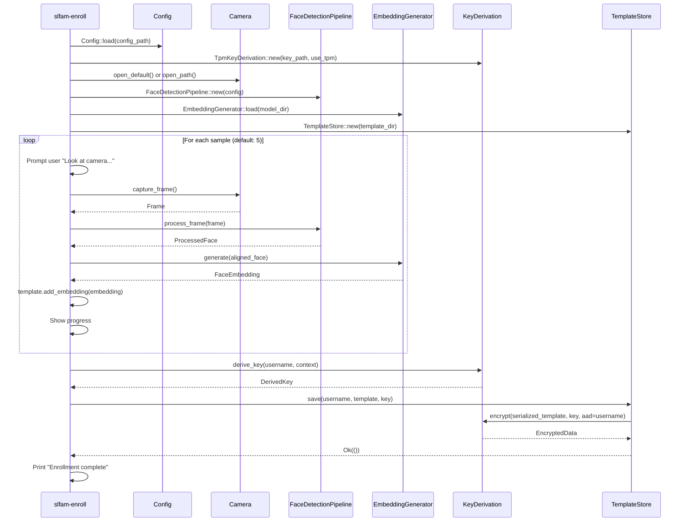
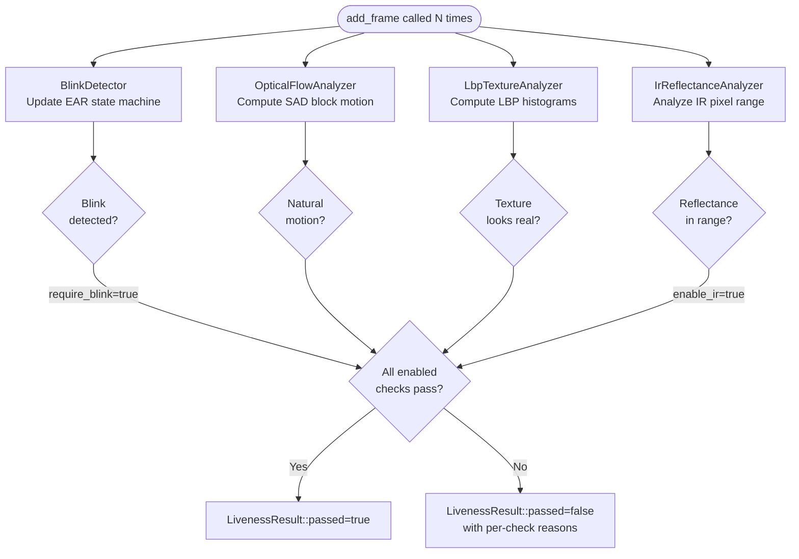
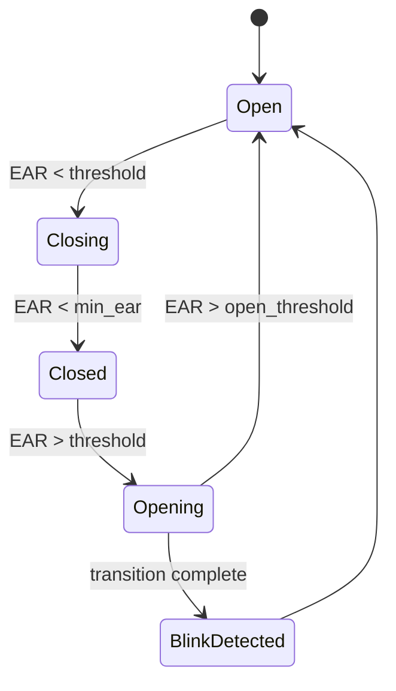
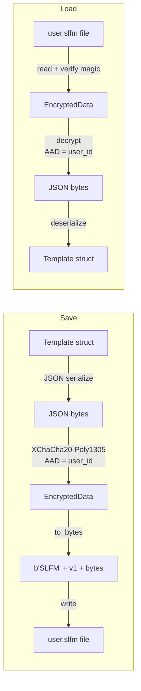
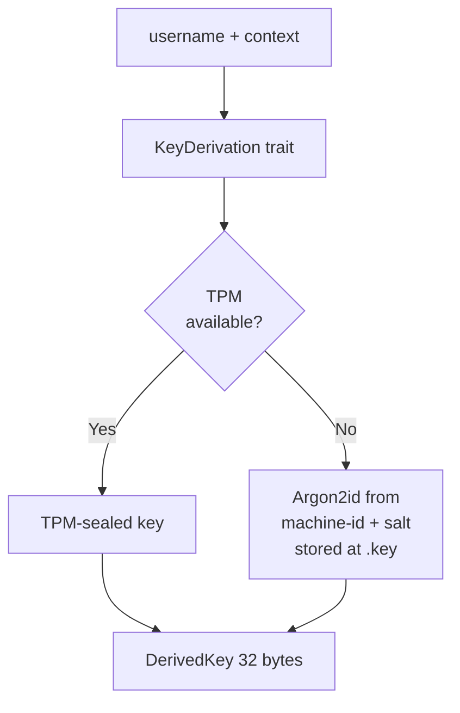
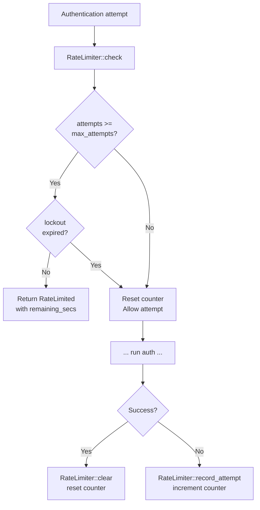

# Workflows — SLFAM

## Authentication Flow

Triggered when PAM calls `pam_sm_authenticate`. Entire flow must complete within `timeout_secs` (default: 10s).



### Error / Fallback Handling



---

## Enrollment Flow (`slfam-enroll`)



---

## Liveness Detection Sub-Pipeline

Runs across a sequence of frames (typically 5–10) captured over ~1–2 seconds.



### Blink Detection Detail (EAR)

Eye Aspect Ratio (EAR) = (vertical distances) / (2 × horizontal distance)



---

## Template Encryption/Decryption Flow



Key derivation for the encryption key:



---

## Rate Limiting Flow



---

## Camera Device Discovery

```mermaid
flowchart TD
    Start([Camera::open]) --> AD{auto_detect\nconfigured?}
    AD -- Yes --> ENUM[enumerate_cameras\n/dev/video0..N]
    AD -- No --> DIRECT[open configured\ndevice_id]
    ENUM --> FINDRGB[find_rgb_camera\ncheck driver name, caps]
    FINDRGB --> FINDIR{prefer_ir\n& IR wanted?}
    FINDIR -- Yes --> FINDIRC[find_ir_camera\ncheck driver keywords]
    FINDIR -- No --> USE[Use RGB camera]
    FINDIRC --> USE
    USE --> LOCK[Acquire DeviceLock\n/tmp/slfam-video{N}.lock]
    LOCK --> MMAP[init_mmap\nV4L2 buffer ring]
    MMAP --> STREAM[start_streaming]
```
